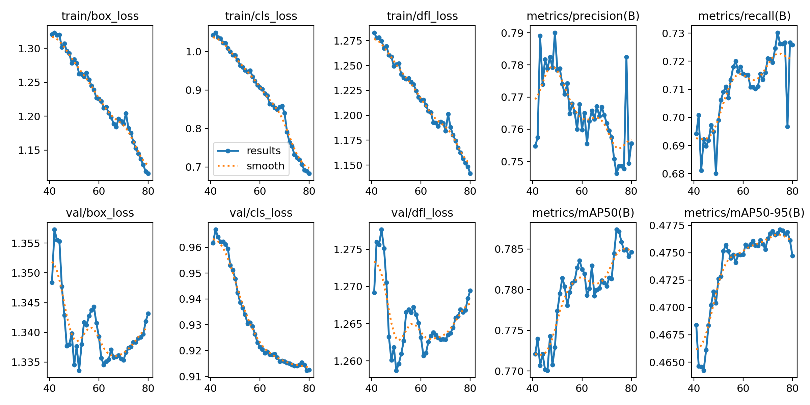
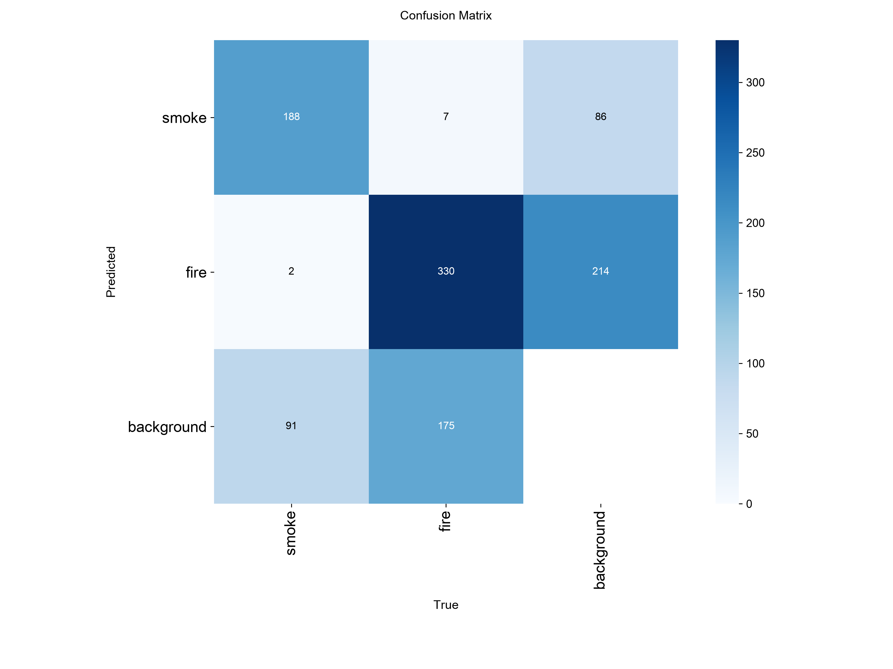
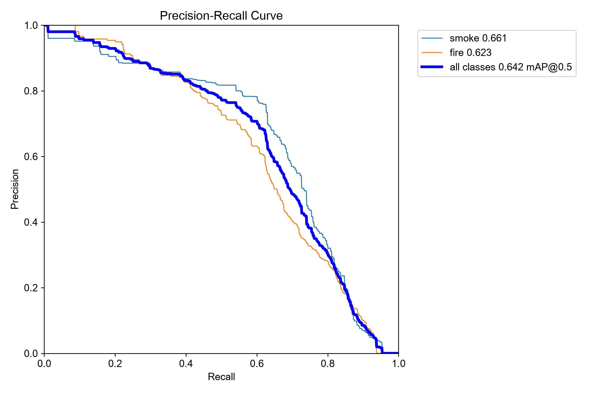

# 🔥 Fire & Smoke Detection (YOLOv11)

Real-time fire and smoke detection with a fine-tuned **YOLOv11n** model, trained on a class-balanced subset of the [D-Fire dataset](https://github.com/gaiasd/DFireDataset). Includes a full reproducible pipeline (data prep → training → evaluation → ONNX export → error analysis) and a live Gradio demo.

### ▶️ [**Try the live demo on Hugging Face Spaces**](https://naman-123-fire-smoke-detection.hf.space)




---

## Why fire/smoke detection is a *recall* problem

This is framed as a **safety-critical** task: a **missed** fire (false negative) is far more costly than a **false alarm** (false positive). That framing drives the design choices below — the goal is to push recall up without letting precision collapse, and to stabilize video predictions so a single noisy frame doesn't cause flicker.

---

## Results

Fine-tuned YOLOv11n (30 epochs, 640 px) on **D-Fire-small** — a balanced 3,000-image subset (2,100 train / 450 val / 450 test), 2 classes: `smoke`, `fire`.

| Metric | Value |
|--------|-------|
| Precision | 0.71 |
| Recall | 0.59 |
| mAP@0.5 | 0.64 |
| mAP@0.5:0.95 | 0.34 |

**Reading these numbers honestly:** recall (0.59) is currently the weak point and the main focus of ongoing work — for a fire detector, missing ~40% of true objects is the metric that matters most. Two contributing factors:

- **Class imbalance at the box level.** Even though the *image* categories are balanced, `fire` boxes outnumber `smoke` boxes roughly 2:1 (train: 2,421 fire vs 1,260 smoke). Smoke is the under-represented and intrinsically harder class (diffuse, low-contrast boundaries), so it drives most of the missed detections.
- **A deliberately small, fast subset** (3k images, 30 epochs) chosen for quick iteration — not the full 21k dataset.

**Next steps** (in progress): retrain on more data / longer schedule, add per-class AP reporting, tune the operating point on the PR curve toward higher recall, and add a **YOLOv11s** variant for an accuracy-vs-speed comparison.

### Evaluation plots

| Confusion matrix | Precision–Recall curve |
|---|---|
|  |  |

### Error analysis

Representative failure cases are saved under `scripts/assets/error_analysis/` (missed fire, missed smoke, false fire, false smoke) — inspecting these is how the class-imbalance conclusion above was reached. Generate them with `scripts/error_analysis.py`.

---

## Deployment

- **ONNX export** (`scripts/export_onnx.py`) for faster CPU inference; `scripts/benchmark.py` compares PyTorch vs ONNX latency and model size.
- **Hosted demo** runs on Hugging Face **ZeroGPU** (free tier). The Space serves the `.pt` model with a `@spaces.GPU`-decorated inference path; it's **image-only** by design (per-frame GPU allocation makes live webcam/video impractical on the free quota).
- **Temporal smoothing** (`utils/Temporal_smoothing.py`) — a lightweight IoU tracker that averages boxes across frames (EMA) so video/webcam detections don't flicker. Used in the full local app.

---

## Quickstart

```bash
git clone https://github.com/naman944/Fire_Smoke-Detection.git
cd Fire_Smoke-Detection
pip install -r requirements.txt
```

**Run the demo locally** (image / video tabs, with temporal smoothing):

```bash
python app.py
```

**Single-file inference:**

```bash
python scripts/predict_image.py --image path/to/image.jpg
python scripts/predict_video.py --video path/to/video.mp4
```

---

## Reproducible pipeline

Every stage is scripted and seeded:

| Step | Script |
|------|--------|
| Analyze full dataset by category | `scripts/analyze_categories.py` |
| Build balanced 3k-image subset | `scripts/create_subset.py` |
| Verify subset integrity (box counts, empty/clamped labels, orphans) | `scripts/verify_subset.py` |
| Train | `scripts/train.py` |
| Evaluate on test split | `scripts/evaluate.py` |
| Export to ONNX | `scripts/export_onnx.py` |
| Benchmark PyTorch vs ONNX | `scripts/benchmark.py` |
| Error analysis (FP/FN samples) | `scripts/error_analysis.py` |

Reports and manifests (dataset stats, subset composition, verification audit) are written to `scripts/reports/`.

---

## Dataset

[D-Fire](https://github.com/gaiasd/DFireDataset) (21,527 labeled images) is subsampled with a **fixed seed** into a balanced set across four categories — `fire_only`, `smoke_only`, `fire_and_smoke`, and `negative/background` — to keep training fast and the class distribution even. Background (negative) images are deliberately included to suppress false positives.

Class mapping: `0 = smoke`, `1 = fire`.

---

## Project structure

```
app.py                  # Gradio demo (image / video), temporal smoothing
configs/dfire_small.yaml  # dataset config (portable relative paths)
scripts/                # data prep, training, eval, export, benchmark, error analysis
scripts/reports/        # generated dataset/subset/verification manifests
utils/                  # inference helpers + temporal smoothing tracker
weights/                # final model: y11n_best.pt and y11n_best.onnx
assets/                 # training curves, confusion matrix, PR curve
```

---

## Tech stack

Ultralytics YOLOv11 · PyTorch · ONNX Runtime · OpenCV · Gradio · Hugging Face Spaces (ZeroGPU)

## License & credits

Model built with [Ultralytics](https://github.com/ultralytics/ultralytics) (AGPL-3.0). Dataset: [D-Fire](https://github.com/gaiasd/DFireDataset) — please cite the original authors per their repository.
